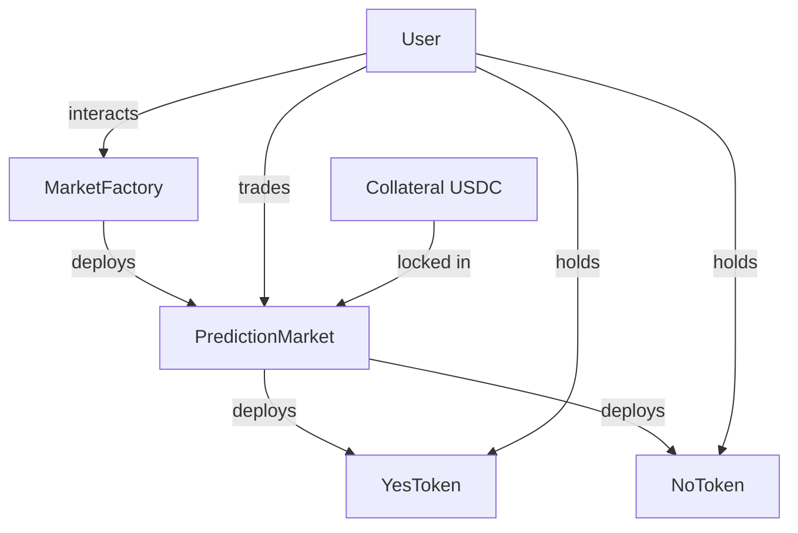
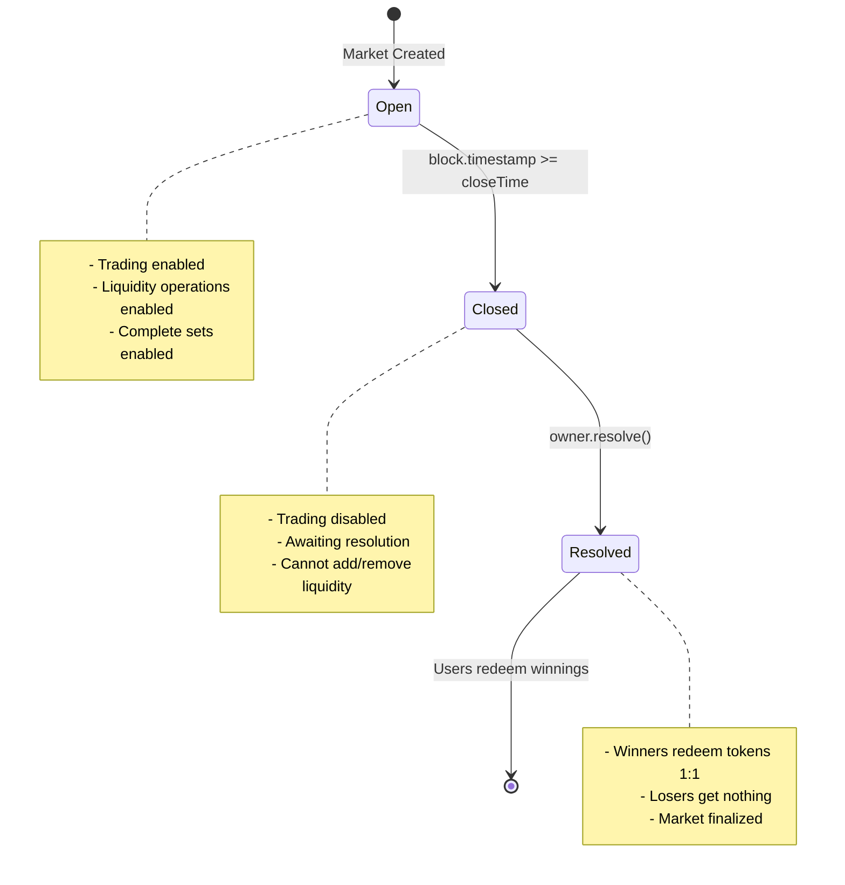

# GeoChain Prediction Market - Technical Architecture

This document provides a comprehensive technical overview of the prediction market protocol architecture, design decisions, and implementation details.

## Table of Contents

- [System Overview](#system-overview)
- [Contract Architecture](#contract-architecture)
- [Market Lifecycle](#market-lifecycle)
- [AMM Mechanism](#amm-mechanism)
- [Liquidity Provision](#liquidity-provision)
- [Fee Structure](#fee-structure)
- [Security Model](#security-model)

## System Overview

The GeoChain Prediction Market is a decentralized protocol for creating and trading binary outcome markets. It uses an automated market maker (AMM) with a constant product formula to enable permissionless trading of outcome tokens.

### Core Components



### Key Design Principles

1. **Decentralization**: No external oracle dependencies for pricing
2. **Permissionless Trading**: Anyone can trade once a market is created
3. **Self-Custody**: Users maintain control of their tokens
4. **Transparency**: All logic is on-chain and verifiable
5. **Capital Efficiency**: Complete sets can be minted/redeemed 1:1 with collateral

## Contract Architecture

### MarketFactory

**Purpose**: Factory pattern for deploying and tracking prediction markets

**Responsibilities**:
- Deploy new PredictionMarket contracts
- Maintain registry of all created markets
- Handle initial liquidity seeding
- Transfer ownership to market creator

**Key Functions**:
```solidity
function createMarket(
    string calldata question,
    uint256 closeTime,
    uint256 resolutionTime,
    uint256 initialLiquidity
) external onlyOwner returns (address market)
```

### PredictionMarket

**Purpose**: Core market contract implementing AMM, lifecycle management, and resolution

**Responsibilities**:
- Manage YES/NO token reserves using constant product AMM
- Handle liquidity provision and LP share accounting
- Enable complete set minting/redemption
- Control market lifecycle (Open → Closed → Resolved)
- Collect and distribute fees
- Resolve market outcome

**State Variables**:
```solidity
// Market Configuration
string public immutable s_question;
IERC20 public immutable i_collateral;
OutcomeToken public immutable yesToken;
OutcomeToken public immutable noToken;
uint256 public immutable closeTime;
uint256 public immutable resolutionTime;

// AMM State
uint256 public yesReserve;
uint256 public noReserve;
uint256 public totalShares;
mapping(address => uint256) public lpShares;

// Market State
State public state; // Open, Closed, Resolved
Resolution public resolution; // Unset, Yes, No, Invalid
```

### OutcomeToken

**Purpose**: ERC20 token representing a specific outcome (YES or NO)

**Responsibilities**:
- Standard ERC20 functionality
- Mint/burn controlled by market contract
- 6 decimals to match USDC collateral

**Key Features**:
- Immutable market address
- Only market can mint/burn
- Matches collateral decimals (6)

## Market Lifecycle



### State Transitions

1. **Open**: Market is active
   - Users can trade YES ↔ NO tokens
   - Liquidity can be added/removed
   - Complete sets can be minted/redeemed

2. **Closed**: Trading period ended
   - Automatically transitions when `block.timestamp >= closeTime`
   - No trading or liquidity operations allowed
   - Awaiting owner resolution

3. **Resolved**: Outcome determined
   - Owner calls `resolve(true/false)` after `resolutionTime`
   - Winning token holders can redeem 1:1 for collateral
   - Market is finalized

## AMM Mechanism

### Constant Product Formula

The AMM uses the constant product market maker (CPMM) formula:

```
k = yesReserve * noReserve
```

Where `k` is maintained constant for each trade.

### Swap Mechanics

**YES → NO Swap**:
```solidity
// Calculate new reserves
k = yesReserve * noReserve
newYesReserve = yesReserve + yesIn
newNoReserve = k / newYesReserve

// Calculate output (before fee)
grossNoOut = noReserve - newNoReserve

// Apply 4% fee
fee = grossNoOut * 400 / 10000
netNoOut = grossNoOut - fee

// Update reserves (fee stays in pool)
yesReserve = newYesReserve
noReserve = newNoReserve + fee
```

**Key Properties**:
- Larger trades have higher slippage
- Fee benefits liquidity providers (stays in pool)
- Reserves always increase overall due to fees
- Price is determined by reserve ratio: `price = yesReserve / noReserve`

### Price Discovery

The market price for YES token is implicitly:
```
Price(YES) = yesReserve / (yesReserve + noReserve)
Price(NO) = noReserve / (yesReserve + noReserve)
Price(YES) + Price(NO) = 1
```

## Liquidity Provision

### Initial Seeding

The market creator provides initial liquidity through the factory:

```solidity
// Factory transfers collateral to market
collateral.transferFrom(creator, market, initialLiquidity);

// Market creates equal YES/NO reserves
yesReserve = initialLiquidity;
noReserve = initialLiquidity;

// Mint LP shares 1:1 with collateral
totalShares = initialLiquidity;
lpShares[creator] = initialLiquidity;
```

### Adding Liquidity

Users add liquidity by depositing YES and NO tokens:

```solidity
// Calculate proportional shares
yesShare = (yesAmount * totalShares) / yesReserve;
noShare = (noAmount * totalShares) / noReserve;
shares = min(yesShare, noShare);

// Use only the required amounts
usedYes = (shares * yesReserve) / totalShares;
usedNo = (shares * noReserve) / totalShares;

// Update reserves and mint shares
yesReserve += usedYes;
noReserve += usedNo;
totalShares += shares;
lpShares[user] += shares;
```

### Removing Liquidity

LPs can withdraw proportional amounts:

```solidity
// Calculate proportional outputs
yesOut = (yesReserve * shares) / totalShares;
noOut = (noReserve * shares) / totalShares;

// Burn shares and return tokens
totalShares -= shares;
lpShares[user] -= shares;
yesReserve -= yesOut;
noReserve -= noOut;
```

### LP Profitability

LPs earn from:
1. **Swap fees** (4% of all swaps stay in pool)
2. **Complete set fees** if they provide the initial liquidity

LPs are exposed to:
1. **Impermanent loss** if reserves become imbalanced
2. **Resolution risk** if holding unbalanced positions

## Fee Structure

| Operation | Fee | Recipient | Purpose |
|-----------|-----|-----------|---------|
| Swap YES ↔ NO | 4% | Liquidity Pool | Compensate LPs for providing liquidity |
| Mint Complete Sets | 3% | Protocol | Revenue for creating new supply |
| Redeem Complete Sets | 2% | Protocol | Revenue for burning supply |

### Fee Distribution

- **Swap Fees**: Stay in pool, benefit all LPs proportionally
- **Protocol Fees**: Accumulate in `protocolCollateralFees`, not currently withdrawable

### Fee Calculation

All fees use basis points (BPS) for precision:
```solidity
FEE_PRECISION_BPS = 10,000 // 100%
SWAP_FEE_BPS = 400          // 4%
MINT_COMPLETE_SETS_FEE_BPS = 300  // 3%
REDEEM_COMPLETE_SETS_FEE_BPS = 200  // 2%

fee = amount * FEE_BPS / FEE_PRECISION_BPS
netAmount = amount - fee
```

## Complete Sets

A "complete set" is 1 YES token + 1 NO token, which is economically equivalent to 1 collateral token (since one outcome must occur).

### Minting Complete Sets

```solidity
// User deposits collateral
collateral.transferFrom(user, market, amount);

// Calculate net amount after fee
fee = amount * 3% 
netAmount = amount - fee

// Mint equal YES and NO tokens
yesToken.mint(user, netAmount);
noToken.mint(user, netAmount);
```

**Use Cases**:
- Acquire tokens to trade
- Provide liquidity
- Arbitrage if market price deviates from 1

### Redeeming Complete Sets

```solidity
// Burn YES and NO tokens
yesToken.burn(user, amount);
noToken.burn(user, amount);

// Calculate net amount after fee
fee = amount * 2%
netAmount = amount - fee

// Return collateral
collateral.transfer(user, netAmount);
```

**Use Cases**:
- Exit position without price impact
- Arbitrage if market price deviates from 1
- Lock in profits on both sides

## Security Model

### Access Control

| Function | Access | Justification |
|----------|--------|---------------|
| `createMarket` | Factory Owner | Quality control on markets |
| `seedLiquidity` | Market Owner | One-time initialization |
| `resolve` | Market Owner | Trusted outcome determination |
| `pause/unpause` | Market Owner | Emergency controls |
| Trading functions | Anyone | Permissionless after creation |

### Reentrancy Protection

All state-changing functions use OpenZeppelin's `ReentrancyGuard`:
```solidity
function swap() external nonReentrant { ... }
```

### Checks-Effects-Interactions Pattern

The code follows CEI pattern where possible:
1. **Checks**: Validate inputs and conditions
2. **Effects**: Update state variables
3. **Interactions**: External calls to tokens

### Time-Based Controls

```solidity
// Market automatically closes at closeTime
modifier marketOpen() {
    _updateState();
    require(state == State.Open);
    _;
}

// Resolution only after resolutionTime
function resolve(bool outcome) external {
    require(block.timestamp >= resolutionTime);
    require(state == State.Closed);
    ...
}
```

### Slippage Protection

All trades include minimum output parameters:
```solidity
function swapYesForNo(uint256 yesIn, uint256 minNoOut) {
    uint256 noOut = calculateOutput(yesIn);
    if (noOut < minNoOut) revert SlippageExceeded();
    ...
}
```

### Pausability

Markets can be paused in emergencies:
```solidity
function pause() external onlyOwner {
    _pause(); // Blocks all trading and liquidity operations
}
```

## Upgrade Path

**Current State**: Contracts are NOT upgradeable

**Rationale**: 
- Simpler security model
- Immutability provides guarantees to users
- Reduces attack surface

**Future Considerations**:
- Unused upgradeable imports have been removed
- Could be added via proxy pattern if needed
- Would require UUPS or Transparent Proxy pattern

## Known Limitations

1. **Centralized Resolution**: Market outcome determined by owner
2. **No Invalid Outcome**: Currently commented out in code
3. **Fixed Fee Structure**: Fees are hardcoded constants
4. **No Fee Withdrawal**: Protocol fees accumulate but can't be withdrawn
5. **Binary Outcomes Only**: No multi-outcome markets

## Gas Optimization Notes

1. **Immutable Variables**: `s_question`, `i_collateral`, tokens, and timestamps save gas
2. **Custom Errors**: More gas-efficient than string reverts
3. **Unchecked Math**: Could be added where overflow impossible
4. **Pack Storage**: State variables ordered by size where possible

---

**Last Updated**: 2026-02-12  
**Version**: 1.0.0  
**Author**: 0xHimxa
