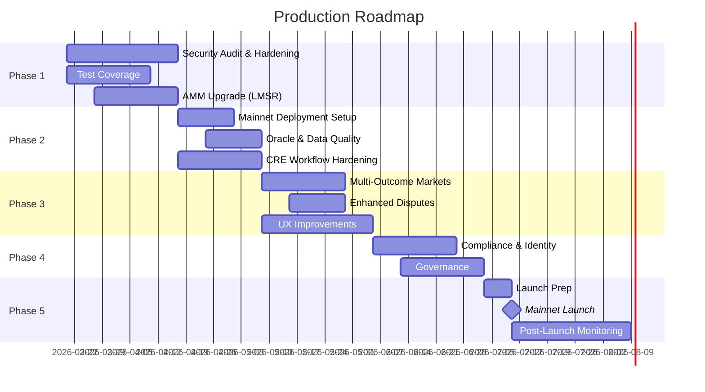

# GeoChain Prediction Market — Production Roadmap

> A phased plan to take the current prediction market from hackathon prototype to production-ready launch.

---

## Current State Summary

| Layer | What Exists | Status |
|---|---|---|
| **Smart Contracts** | `PredictionMarket` (CPMM AMM), `MarketFactory` (hub/spoke UUPS upgradeable), `RouterVault` (user accounting + agent delegation), `Bridge` (CCIP lock-mint-burn), `CanonicalPricingModule`, libraries, `OutcomeToken` | ✅ Functional |
| **CRE Workflows** | `market-automation-workflow` (8 cron handlers), `market-users-workflow` (HTTP + EVM-log), `agents-workflow` (4 HTTP handlers) | ✅ Functional |
| **Tests** | Unit (4 files), stateful fuzz (2 files), stateless fuzz (1 file) — Foundry | ⚠️ Needs expansion |
| **Chains** | Arbitrum Sepolia (hub), Base Sepolia (spoke), Sepolia | ⚠️ Testnet only |

---

## Phase 1 — Code Hardening & Audit Readiness (Weeks 1–4)

### 1.1 Security Audit Preparation

- [ ] **Formal audit** — Engage at least one professional auditing firm (e.g., Trail of Bits, OpenZeppelin, Cyfrin). Budget 4–6 weeks.
- [ ] **Internal review** — Conduct line-by-line review of all `external`/`public` functions for re-entrancy, overflow, access-control, and front-running vectors.
- [ ] **Static analysis** — Integrate Slither and Aderyn into CI and resolve all high/medium findings.
- [ ] **Mutation testing** — Run Gambit or Vertigo to validate test robustness.

### 1.2 Test Coverage Expansion

- [ ] **Target ≥ 95% line coverage** on all `src/` contracts via `forge coverage`.
- [ ] Expand fuzz tests:
  - Multi-user concurrent swap + liquidity scenarios.
  - Edge reserves near zero (one-sided pool drainage).
  - Full lifecycle fuzz: create → trade → resolve → redeem → withdraw.
- [ ] Add invariant tests:
  - `yesReserve * noReserve >= k` never decreases (except by fee extraction only).
  - `totalShares == Σ lpShares[user]` at all times.
  - `collateral.balanceOf(market) >= (totalShares + protocolFees)` — solvency.
  - CCIP message nonces are strictly monotonic.
- [ ] Cross-chain integration test (Foundry fork mode on both hub + spoke).
- [ ] RouterVault agent permission boundary tests.

### 1.3 AMM Model Upgrade (CPMM → LMSR)

> See [CODE_ALTERNATIVES.md](./CODE_ALTERNATIVES.md) for detailed implementation guidance.

- [ ] Implement `LMSRLib.sol` — logarithmic cost function with configurable `b` parameter.
- [ ] Migrate swap, pricing, and liquidity functions.
- [ ] Retain `CanonicalPricingModule` deviation bands (compatible with LMSR pricing).
- [ ] Full regression test suite for new AMM model.

### 1.4 Gas Optimization

- [ ] Profile gas per core operation (`mintCompleteSets`, `swap`, `redeem`, `addLiquidity`).
- [ ] Evaluate packed storage for `PredictionMarketBase` state variables.
- [ ] Replace `keccak256(abi.encode(...))` action-hash comparisons with `bytes4` selectors or constant precomputed hashes (some already precomputed — ensure all are).
- [ ] Consider `SSTORE2` for immutable large config data.

---

## Phase 2 — Production Infrastructure (Weeks 5–8)

### 2.1 Mainnet Deployment Strategy

- [ ] **Target chains**: Arbitrum One (hub), Base (spoke), optionally Polygon PoS or Optimism.
- [ ] Deploy using deterministic `CREATE2` via a deployer factory for cross-chain address consistency.
- [ ] Use multi-sig (Safe) as `owner` for all upgradeable proxies — never EOA.
- [ ] Implement deployment scripts for mainnet (currently only `deployMarketFactory.s.sol` exists; add mainnet variants with proper gas settings).
- [ ] Configure timelock on upgrade transactions (24–48 hr minimum).

### 2.2 Collateral Strategy

- [ ] Switch from mintable test token to **USDC** or **USDT** (6 decimals — aligns with existing `OutcomeToken.decimals()`).
- [ ] Add collateral allowlist in `MarketFactory` so only approved stablecoins are accepted.
- [ ] Implement fee treasury — separate contract that receives protocol fees via pull pattern.

### 2.3 Oracle & Data Quality

- [ ] Integrate **Chainlink Data Feeds** for price-related markets (e.g., "Will ETH be above $X?") to enable verifiable on-chain resolution.
- [ ] Add a **multi-source resolution quorum** — the current single-Gemini resolution is a centralization risk:
  - Multiple independent AI/oracle feeds vote.
  - Require ≥ 2 of 3 agreement.
  - Human backstop for disputed outcomes.
- [ ] Add market categories with resolution source metadata (oracle-resolvable vs opinion-based).

### 2.4 CRE Workflow Hardening

- [ ] **Error handling** — Currently, handler exceptions during cron can silently skip markets. Add per-market retry queues with exponential backoff.
- [ ] **Idempotency** — Ensure all report handlers are safe to re-execute (most already are via nonce/state checks).
- [ ] **Rate limiting** — Guard against runaway cron iterations on large market count (cap loop count per invocation).
- [ ] **Monitoring** — Emit structured logs (JSON) from all handlers for ELK/Datadog integration.
- [ ] **Secrets rotation** — Implement key rotation for CRE authorized keys and Firebase credentials.
- [ ] Separate cron schedules per handler type (resolution can run every 10 min; price sync every 2 min; market creation daily).

---

## Phase 3 — Product Features (Weeks 9–14)

### 3.1 Multi-Outcome Markets

- [ ] Extend beyond binary YES/NO to **N-outcome** markets (e.g., "Which team wins: A, B, C?").
- [ ] Deploy N `OutcomeToken` contracts per market.
- [ ] Adapt LMSR cost function for N outcomes (native LMSR strength).
- [ ] Update `MarketFactory` to parameterize outcome count.

### 3.2 Market Categories & Discovery

- [ ] Add market metadata (category, tags, icon URL, resolution source) stored in `MarketFactory` events or off-chain via IPFS.
- [ ] Build market indexer using The Graph or Ponder for fast frontend queries.
- [ ] Implement trending/popular sorting based on volume or LP depth.

### 3.3 Enhanced Dispute System

- [ ] **Staked disputes** — Require bond/collateral for disputants. If dispute fails, bond is slashed.
- [ ] **Decentralized arbitration** — Consider Kleros or UMA's optimistic oracle for disputed outcomes instead of owner-only adjudication.
- [ ] Extend `disputeWindow` based on market size or category risk.

### 3.4 User Experience

- [ ] Implement limit orders via off-chain order book + on-chain settlement.
- [ ] Add market-closing countdown and notification system.
- [ ] Portfolio page: P&L tracking, position history, trade history via event indexing.
- [ ] Mobile-responsive trading interface.

### 3.5 Cross-Chain Enhancements

- [ ] Optimize CCIP message batching — batch multiple price syncs into one CCIP message to reduce fees.
- [ ] Add CCIP failover monitoring — alert if price sync fails for > 30 min.
- [ ] Bridge UX: display estimated bridge times, track pending transfers.

---

## Phase 4 — Compliance, Governance & Scale (Weeks 15–20+)

### 4.1 Compliance & Identity

- [ ] Integrate **Worldcoin** proof-of-personhood for sybil resistance (partial integration already exists).
- [ ] Add KYC/KYB gates for markets above configurable volume thresholds.
- [ ] Geo-restriction logic — block restricted jurisdictions at frontend + smart contract level.
- [ ] Legal review of market categories (avoid regulated instruments).

### 4.2 Protocol Governance

- [ ] Deploy governance token (optional — evaluate if needed vs. multisig).
- [ ] Community-driven market creation proposals.
- [ ] DAO-controlled fee parameters.
- [ ] Quadratic voting for dispute resolution (for non-objective markets).

### 4.3 CRE Confidential Compute (2026)

- [ ] Leverage Chainlink's **Confidential Compute on CRE** (launching early 2026) for:
  - Private resolution logic (prevent front-running resolution).
  - Private agent trading strategies.
  - Sealed-bid order types.

### 4.4 Scaling & Performance

- [ ] L3/Appchain evaluation — if volume justifies, deploy an app-specific rollup.
- [ ] Batch market creation via multicall.
- [ ] Subgraph/indexer for historical data and analytics dashboard.
- [ ] API rate limiting and caching layer for frontend integration.

---

## Phase 5 — Launch Checklist

### Pre-Launch (1 week before)

- [ ] All audit findings resolved and re-verified.
- [ ] Emergency pause mechanism tested end-to-end.
- [ ] Multisig signers confirmed and hardware-wallet secured.
- [ ] Bug bounty program live (Immunefi recommended — minimum $50k pool).
- [ ] Documentation: user guide, developer docs, API reference.
- [ ] Frontend security review (CSP, input sanitization, wallet connection safety).

### Launch Day

- [ ] Deploy contracts to mainnet via verified, reproducible build.
- [ ] Verify all contracts on block explorers.
- [ ] Activate CRE workflows pointed to mainnet contracts.
- [ ] Monitor first market creation → trade → resolution cycle end-to-end.
- [ ] Announce and open to beta users.

### Post-Launch (first 30 days)

- [ ] Daily monitoring of:
  - Contract TVL vs collateral solvency.
  - CRE handler success/failure rate.
  - CCIP message delivery latency.
  - Arbitrage handler effectiveness (deviation convergence rate).
- [ ] Gradual increase of `MAX_RISK_EXPOSURE` caps.
- [ ] User feedback collection and priority bug fix cycles.
- [ ] Weekly security review of admin operations log.

---

## Summary Timeline

