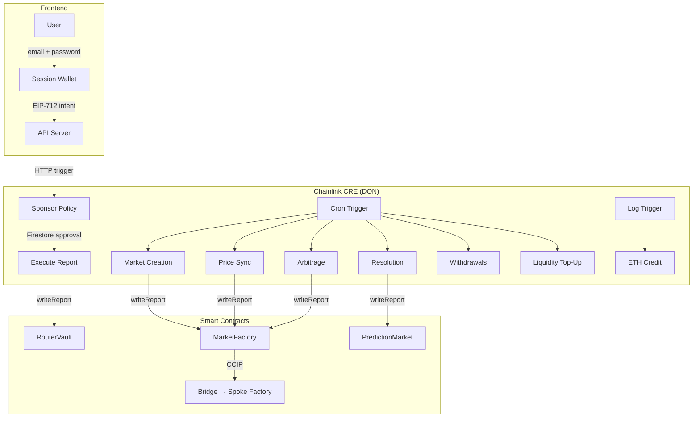

<p align="center">
  <h1 align="center">🌐 GeoChain</h1>
  <p align="center"><strong>Cross-Chain Prediction Markets Powered by Chainlink CRE</strong></p>
  <p align="center">
    <a href="https://chain.link/hackathon"></a>
    
    
    
  </p>
</p>

---

> A self-operating, cross-chain prediction market protocol where **one Chainlink CRE workflow replaces five backend services** — enabling Web2 onboarding, gasless trading without Account Abstraction, AI-assisted market creation, and fully automated cross-chain operations.

---

## Table of Contents

- [The Problem](#the-problem)
  - [For Users](#for-users)
  - [For Operators](#for-operators)
- [How It's Done Today (And Why It Falls Short)](#how-its-done-today-and-why-it-falls-short)
- [Our Approach: One CRE Workflow, Zero Backend](#our-approach-one-cre-workflow-zero-backend)
- [Architecture Overview](#architecture-overview)
- [Chainlink Integration](#chainlink-integration)
  - [Chainlink CRE (Runtime Environment)](#1-chainlink-cre-runtime-environment)
  - [Chainlink CCIP (Cross-Chain Interoperability)](#2-chainlink-ccip-cross-chain-interoperability)
- [Smart Contracts](#smart-contracts)
- [End-to-End Flows](#end-to-end-flows)
- [Installation & Setup](#installation--setup)
- [Deployed Contracts (Testnet)](#deployed-contracts-testnet)
- [Repository Structure](#repository-structure)
- [Security](#security)
- [License](#license)

---

## The Problem

### For Users

Prediction markets have grown into a $3.5B+ industry (Polymarket alone processed $9B in 2024). Yet the vast majority of people **never place a single trade** — not because they're uninterested, but because the onboarding flow still looks like this:

```
Install MetaMask → Write down 12 words → Buy ETH on Coinbase →
Transfer to wallet → Bridge to L2 → Approve USDC → Finally trade
```

That's **7 steps** before a single "Yes" or "No" bet. Polymarket simplified this with custodial accounts, but at the cost of centralization — a fact underscored when their third-party auth provider was breached in December 2025. Account Abstraction (ERC-4337) promises gasless UX, but requires bundlers (Pimlico, Stackup, Alchemy), Paymaster contracts, and EntryPoint coordination — adding 3–4 infrastructure dependencies to the stack.

**The result:** either you sacrifice decentralization for UX, or you sacrifice UX for decentralization.

### For Operators

Running a production prediction market today isn't just deploying a smart contract — it's operating a distributed system:

| Service | Responsibility | Failure Mode |
|---|---|---|
| **Relayer / Bundler** | Submit gasless transactions | Drops trades if mempool is full |
| **Cron Service** | Create markets, trigger resolution | Silent failure = markets never resolve |
| **Event Listener** | Detect deposits, track on-chain events | Missed events = lost user funds |
| **Cross-Chain Sync** | Keep prices consistent across chains | Stale prices = arbitrage attacks |
| **Database + Auth** | Track user sessions, payment state | Single point of failure |
| **AI / Oracle Adapter** | Generate market questions, fetch outcomes | API key expiry = halted market creation |

That's **6 separate services**, each requiring its own deployment pipeline, monitoring dashboard, error recovery strategy, and on-call rotation. Operators must maintain uptime across all of them simultaneously — one service going down can cascade into user-facing failures.

---

## How It's Done Today (And Why It Falls Short)

| Dimension | Polymarket | Kalshi | AA-Based Prediction Markets | **GeoChain** |
|---|---|---|---|---|
| **User Onboarding** | Email sign-up (custodial) | KYC + bank account | Wallet required + bundler overhead | Email + password → session wallet |
| **Gasless Trading** | Paid by Polymarket (centralized relay) | N/A (centralized exchange) | ERC-4337 bundler + Paymaster | CRE-sponsored execution (no bundler) |
| **Trade Execution** | Off-chain CLOB + on-chain settlement | Fully off-chain | On-chain via smart accounts | On-chain via CRE `writeReport()` |
| **Cross-Chain** | Single chain (Polygon) | No blockchain | Not typically cross-chain | Hub + spoke via CCIP |
| **Market Creation** | Admin/governance | Regulatory + human curated | Manual | AI-generated (Gemini) via CRE cron |
| **Resolution** | UMA Optimistic Oracle (24h+ delay) | Human adjudication | Varies | Automated CRE cron + optional dispute window |
| **Backend Services** | 5–6 (relayer, event listener, CLOB engine, DB, oracle adapter, cron) | Traditional exchange stack | Bundler, Paymaster, EntryPoint, relayer, cron | **1** (single CRE workflow) |
| **Custody Model** | Hybrid (custodial hot wallets) | Fully custodial | Non-custodial (smart accounts) | Non-custodial (browser-local encrypted wallet) |
| **Price Consistency** | Single chain, N/A | N/A | N/A | Canonical pricing + deviation bands + auto-arbitrage |
| **Funding Options** | Crypto (USDC on Polygon) | Fiat (bank transfer) | Crypto only | USDC + fiat + ETH (all via CRE) |

### What Each Approach Gets Wrong

**Polymarket** solved UX but introduced centralization risk — both through its custodial model and its reliance on off-chain infrastructure that has been exploited. Its hybrid CLOB + on-chain architecture creates a timing gap between off-chain matching and on-chain settlement that sophisticated actors can exploit.

**Kalshi** proves the demand for prediction markets is real but operates as a traditional exchange — no blockchain settlement, no composability, no cross-chain. Every market requires regulatory approval, creating a bottleneck.

**AA-based platforms** tackle gasless UX correctly in principle, but in practice add 3–4 infrastructure dependencies (bundler, Paymaster, EntryPoint, factory). Native Ethereum Account Abstraction (EIP-8141) isn't expected until the second half of 2026.

---

## Our Approach: One CRE Workflow, Zero Backend

GeoChain replaces the entire backend stack with a single Chainlink CRE workflow:

```
┌──────────────────────────────────────────────────────────────────────┐
│          TRADITIONAL PREDICTION MARKET BACKEND                       │
│                                                                      │
│  ┌─────────┐ ┌─────────┐ ┌─────────┐ ┌─────────┐ ┌─────────┐       │
│  │ Relayer │ │  Cron   │ │ Events  │ │ X-Chain │ │ DB/Auth │       │
│  │ Service │ │ Service │ │ Listener│ │  Sync   │ │ Service │       │
│  └────┬────┘ └────┬────┘ └────┬────┘ └────┬────┘ └────┬────┘       │
│       │           │           │           │           │              │
│       ▼           ▼           ▼           ▼           ▼              │
│  5 deployments · 5 dashboards · 5 failure modes · 5 on-call pages   │
└──────────────────────────────────────────────────────────────────────┘
                              │
                    REPLACED BY
                              │
                              ▼
┌──────────────────────────────────────────────────────────────────────┐
│              GEOCHAIN: ONE CRE WORKFLOW                              │
│                                                                      │
│  13 handlers · 3 trigger types · BFT consensus · 1 config file      │
│                                                                      │
│  Cron ──► Market creation · Price sync · Arbitrage · Resolution     │
│           Liquidity top-up · Withdrawal processing                   │
│  HTTP ──► Sponsor policy · Execute report · Fiat credit             │
│           Session revocation                                         │
│  Log  ──► ETH deposit credit                                        │
│                                                                      │
│  0 servers · 0 databases · 0 dashboards · 0 monitoring              │
└──────────────────────────────────────────────────────────────────────┘
```

**Key innovations:**

1. **Gasless without AA:** CRE's two-step sponsor→execute flow replaces the entire ERC-4337 stack (bundler, Paymaster, EntryPoint). A policy handler validates the action, writes a one-time approval to Firestore, and a second handler consumes it and submits the on-chain report — all with BFT consensus, no external bundler needed.

2. **Session wallets, not smart accounts:** Users sign in with email/password. A cryptographic key is derived and stored encrypted (AES-GCM) in the browser. This session wallet signs EIP-712 intents that CRE executes on-chain. Non-custodial security, Web2 onboarding.

3. **AI market creation:** A CRE cron handler queries Firestore for pending market requests, calls Gemini AI to generate well-formed questions with resolution criteria, then deploys markets to all configured chains in a single handler execution.

4. **Self-correcting cross-chain markets:** Hub prices are pushed to spokes via CCIP. If spoke AMM prices deviate beyond threshold, CRE's arbitrage handler automatically submits bounded correction trades — no manual intervention, no MEV bots needed.

5. **Multi-source funding in one vault:** The RouterVault accepts USDC deposits, fiat payments (via CRE HTTP handler), and ETH transfers (via CRE log trigger with price conversion). Users see one unified collateral balance regardless of how they funded.

---

## Architecture Overview

```
┌──────────────────────────────────────────────────────────────────────┐
│                      FRONTEND (React + Vite)                         │
│   Web2 sign-in · Session wallet · Multi-chain · Fiat/ETH funding     │
└───────────────────────────┬──────────────────────────────────────────┘
                            │ HTTP triggers
┌───────────────────────────▼──────────────────────────────────────────┐
│                CHAINLINK CRE WORKFLOW (TypeScript)                    │
│   13 handlers · 3 trigger types · 1 unified runtime                  │
│                                                                      │
│   Cron ──► Market creation · Price sync · Arbitrage                  │
│            Resolution · Liquidity top-up · Withdrawals               │
│   HTTP ──► Sponsor policy · Execute report · Fiat credit             │
│            Session revocation                                        │
│   Log  ──► ETH deposit credit                                        │
└───────────────────────────┬──────────────────────────────────────────┘
                            │ on-chain reports (writeReport)
┌───────────────────────────▼──────────────────────────────────────────┐
│             SMART CONTRACTS (Solidity 0.8.33, Foundry)                │
│                                                                      │
│   Arbitrum Sepolia (HUB) ◄───── CCIP ─────► Base Sepolia (SPOKE)    │
│   MarketFactory · PredictionMarket · RouterVault · Bridge            │
└──────────────────────────────────────────────────────────────────────┘
```

### Data Flow



---

## Chainlink Integration

### 1. Chainlink CRE (Runtime Environment)

CRE is the **operational backbone** of GeoChain. Every automated action — market creation, price sync, sponsored execution, funding — runs as a CRE handler with BFT consensus.

#### CRE Workflow Entry Point

| File | Description |
|---|---|
| [`main.ts`](https://github.com/0xHimxa/GeoChain-contrat/blob/main/cre/market-workflow/main.ts) | Workflow graph composing all 13 handlers via `Runner` |
| [`workflow.yaml`](https://github.com/0xHimxa/GeoChain-contrat/blob/main/cre/market-workflow/workflow.yaml) | CRE CLI target settings (staging/production) |
| [`project.yaml`](https://github.com/0xHimxa/GeoChain-contrat/blob/main/cre/project.yaml) | RPC endpoints for Arbitrum Sepolia + Base Sepolia |
| [`config.staging.json`](https://github.com/0xHimxa/GeoChain-contrat/blob/main/cre/market-workflow/config.staging.json) | Runtime config: schedules, policies, chain addresses, authorized keys |

#### CRE HTTP Handlers (Sponsored Execution + Funding)

| Handler | File | What It Does | Key Lines |
|---|---|---|---|
| **Sponsor Policy** | [`httpSponsorPolicy.ts`](https://github.com/0xHimxa/GeoChain-contrat/blob/main/cre/market-workflow/handlers/httpHandlers/httpSponsorPolicy.ts) | Validates action/chain/amount/session against policy, writes 1-time Firestore approval | [L114–L128](https://github.com/0xHimxa/GeoChain-contrat/blob/main/cre/market-workflow/handlers/httpHandlers/httpSponsorPolicy.ts#L114-L128) (action validation), [L189–L198](https://github.com/0xHimxa/GeoChain-contrat/blob/main/cre/market-workflow/handlers/httpHandlers/httpSponsorPolicy.ts#L189-L198) (approval record) |
| **Execute Report** | [`httpExecuteReport.ts`](https://github.com/0xHimxa/GeoChain-contrat/blob/main/cre/market-workflow/handlers/httpHandlers/httpExecuteReport.ts) | Consumes approval exactly once, submits on-chain report via `writeReport()` | [L176–L190](https://github.com/0xHimxa/GeoChain-contrat/blob/main/cre/market-workflow/handlers/httpHandlers/httpExecuteReport.ts#L176-L190) (consumption), [L230–L247](https://github.com/0xHimxa/GeoChain-contrat/blob/main/cre/market-workflow/handlers/httpHandlers/httpExecuteReport.ts#L230-L247) (writeReport) |
| **Fiat Credit** | [`httpFiatCredit.ts`](https://github.com/0xHimxa/GeoChain-contrat/blob/main/cre/market-workflow/handlers/httpHandlers/httpFiatCredit.ts) | Validates fiat payment, consumes payment record, emits `routerCreditFromFiat` | [L187–L219](https://github.com/0xHimxa/GeoChain-contrat/blob/main/cre/market-workflow/handlers/httpHandlers/httpFiatCredit.ts#L187-L219) |
| **Session Revoke** | [`httpRevokeSession.ts`](https://github.com/0xHimxa/GeoChain-contrat/blob/main/cre/market-workflow/handlers/httpHandlers/httpRevokeSession.ts) | Invalidates user sessions via EIP-712 signed revocation | Full file |

#### CRE Cron Handlers (Market Lifecycle Automation)

| Handler | File | What It Does | Key Lines |
|---|---|---|---|
| **Market Creation** | [`marketCreation.ts`](https://github.com/0xHimxa/GeoChain-contrat/blob/main/cre/market-workflow/handlers/cronHandlers/marketCreation.ts) | Firestore + Gemini AI → generates market questions → deploys to all chains | [L88–L89](https://github.com/0xHimxa/GeoChain-contrat/blob/main/cre/market-workflow/handlers/cronHandlers/marketCreation.ts#L88-L89) (Firebase), [L100](https://github.com/0xHimxa/GeoChain-contrat/blob/main/cre/market-workflow/handlers/cronHandlers/marketCreation.ts#L100) (Gemini), [L108–L116](https://github.com/0xHimxa/GeoChain-contrat/blob/main/cre/market-workflow/handlers/cronHandlers/marketCreation.ts#L108-L116) (multi-chain deploy) |
| **Price Sync** | [`syncPrice.ts`](https://github.com/0xHimxa/GeoChain-contrat/blob/main/cre/market-workflow/handlers/cronHandlers/syncPrice.ts) | Reads hub AMM prices → pushes canonical prices to spokes with validity windows | [L134–L164](https://github.com/0xHimxa/GeoChain-contrat/blob/main/cre/market-workflow/handlers/cronHandlers/syncPrice.ts#L134-L164) (hub read), [L179–L200](https://github.com/0xHimxa/GeoChain-contrat/blob/main/cre/market-workflow/handlers/cronHandlers/syncPrice.ts#L179-L200) (spoke write) |
| **Arbitrage** | [`arbitrage.ts`](https://github.com/0xHimxa/GeoChain-contrat/blob/main/cre/market-workflow/handlers/cronHandlers/arbitrage.ts) | Detects unsafe deviation → submits bounded `priceCorrection` reports | [L104–L126](https://github.com/0xHimxa/GeoChain-contrat/blob/main/cre/market-workflow/handlers/cronHandlers/arbitrage.ts#L104-L126) (deviation check), [L151–L171](https://github.com/0xHimxa/GeoChain-contrat/blob/main/cre/market-workflow/handlers/cronHandlers/arbitrage.ts#L151-L171) (correction) |
| **Resolution** | [`resolve.ts`](https://github.com/0xHimxa/GeoChain-contrat/blob/main/cre/market-workflow/handlers/cronHandlers/resolve.ts) | Checks `checkResolutionTime()` → submits `ResolveMarket` reports | [L86–L130](https://github.com/0xHimxa/GeoChain-contrat/blob/main/cre/market-workflow/handlers/cronHandlers/resolve.ts#L86-L130) |
| **Liquidity Top-Up** | [`topUpMarket.ts`](https://github.com/0xHimxa/GeoChain-contrat/blob/main/cre/market-workflow/handlers/cronHandlers/topUpMarket.ts) | Monitors factory/bridge/router balances → mints USDC when below threshold | [L76–L248](https://github.com/0xHimxa/GeoChain-contrat/blob/main/cre/market-workflow/handlers/cronHandlers/topUpMarket.ts#L76-L248) |
| **Withdrawals** | [`marketWithdrawal.ts`](https://github.com/0xHimxa/GeoChain-contrat/blob/main/cre/market-workflow/handlers/cronHandlers/marketWithdrawal.ts) | Drains post-resolution withdrawal queue in batches | Full file |

#### CRE EVM Log Handler

| Handler | File | What It Does | Key Lines |
|---|---|---|---|
| **ETH Credit** | [`ethCreditFromLogs.ts`](https://github.com/0xHimxa/GeoChain-contrat/blob/main/cre/market-workflow/handlers/eventsHandler/ethCreditFromLogs.ts) | Listens for `EthReceived` → converts ETH→USDC → deterministic `depositId` → submits `routerCreditFromEth` | [L72–L75](https://github.com/0xHimxa/GeoChain-contrat/blob/main/cre/market-workflow/handlers/eventsHandler/ethCreditFromLogs.ts#L72-L75) (event match), [L129–L157](https://github.com/0xHimxa/GeoChain-contrat/blob/main/cre/market-workflow/handlers/eventsHandler/ethCreditFromLogs.ts#L129-L157) (depositId + report) |

#### CRE Report Receivers (Smart Contract Side)

Every `writeReport()` from CRE hits a `_processReport()` dispatcher on-chain:

| Contract | File | Dispatcher Lines | Actions Handled |
|---|---|---|---|
| **MarketFactory** | [`MarketFactoryOperations.sol`](https://github.com/0xHimxa/GeoChain-contrat/blob/main/contract/src/marketFactory/MarketFactoryOperations.sol) | [L24–L70](https://github.com/0xHimxa/GeoChain-contrat/blob/main/contract/src/marketFactory/MarketFactoryOperations.sol#L24-L70) | `createMarket`, `broadCastPrice`, `syncSpokeCanonicalPrice`, `broadCastResolution`, `priceCorrection`, `mintCollateralTo`, `addLiquidityToFactory`, `withDrawCollatralAndFee`, `processPendingWithdrawals` |
| **PredictionMarket** | [`PredictionMarketResolution.sol`](https://github.com/0xHimxa/GeoChain-contrat/blob/main/contract/src/predictionMarket/PredictionMarketResolution.sol) | [L167–L175](https://github.com/0xHimxa/GeoChain-contrat/blob/main/contract/src/predictionMarket/PredictionMarketResolution.sol#L167-L175) | `ResolveMarket` |
| **RouterVault** | [`PredictionMarketRouterVaultOperations.sol`](https://github.com/0xHimxa/GeoChain-contrat/blob/main/contract/src/router/PredictionMarketRouterVaultOperations.sol) | [L344–L391](https://github.com/0xHimxa/GeoChain-contrat/blob/main/contract/src/router/PredictionMarketRouterVaultOperations.sol#L344-L391) | `routerMintCompleteSets`, `routerSwapYesForNo`, `routerSwapNoForYes`, `routerRedeemCompleteSets`, `routerRedeem`, `routerAddLiquidity`, `routerRemoveLiquidity`, `routerCreditFromFiat`, `routerCreditFromEth`, `routerDepositFor`, `routerWithdrawCollateral`, `routerWithdrawOutcome` |

All three contracts inherit [`ReceiverTemplateUpgradeable`](https://github.com/0xHimxa/GeoChain-contrat/blob/main/contract/src/marketFactory/MarketFactoryBase.sol#L11) from the Chainlink CRE SDK, initialized with a forwarder address during proxy deployment.

#### CRE SDK Capabilities Used

| Capability | SDK Import | Purpose |
|---|---|---|
| Cron triggers | `CronCapability` | Schedules 6 automation handlers |
| HTTP endpoints | `HTTPCapability` | 4 policy/execution handlers |
| EVM log listening | `EVMClient.logTrigger()` | ETH deposit crediting |
| On-chain reads | `EVMClient.callContract()` | Read market lists, prices, balances |
| On-chain writes | `EVMClient.writeReport()` | Submit consensus-signed reports |
| BFT report signing | `runtime.report()` | Request DON consensus on reports |
| Network resolution | `getNetwork()` | Resolve chain selectors |
| Calldata encoding | `encodeCallMsg()` | Encode contract call parameters |
| Workflow composition | `Runner`, `handler()` | Compose trigger→handler pairs |

---

### 2. Chainlink CCIP (Cross-Chain Interoperability)

CCIP handles hub→spoke price and resolution synchronization. CRE triggers the broadcast on the hub; CCIP delivers the message to the spoke.

| File | What It Does | Key Lines |
|---|---|---|
| [`MarketFactoryCcip.sol`](https://github.com/0xHimxa/GeoChain-contrat/blob/main/contract/src/marketFactory/MarketFactoryCcip.sol) | Hub-side: `_broadcastCanonicalPrice()` and `_broadcastResolution()` build CCIP messages and call `ccipSend()` | [L307–L328](https://github.com/0xHimxa/GeoChain-contrat/blob/main/contract/src/marketFactory/MarketFactoryCcip.sol#L307-L328) (`ccipSend`) |
| [`PredictionMarketBridge.sol`](https://github.com/0xHimxa/GeoChain-contrat/blob/main/contract/src/Bridge/PredictionMarketBridge.sol) | Bridge contract: receives CCIP messages on spoke, forwards price/resolution updates to spoke factory | [L574](https://github.com/0xHimxa/GeoChain-contrat/blob/main/contract/src/Bridge/PredictionMarketBridge.sol#L574) (ccipSend) |
| [`PredictionMarketResolution.sol`](https://github.com/0xHimxa/GeoChain-contrat/blob/main/contract/src/predictionMarket/PredictionMarketResolution.sol) | Spoke-side receivers: `resolveFromHub()`, `syncCanonicalPriceFromHub()` apply CCIP-delivered updates | [L129–L141](https://github.com/0xHimxa/GeoChain-contrat/blob/main/contract/src/predictionMarket/PredictionMarketResolution.sol#L129-L141) (resolveFromHub), [L146–L163](https://github.com/0xHimxa/GeoChain-contrat/blob/main/contract/src/predictionMarket/PredictionMarketResolution.sol#L146-L163) (syncPrice) |
| [`Client.sol`](https://github.com/0xHimxa/GeoChain-contrat/blob/main/contract/src/ccip/Client.sol) | CCIP message types (`EVM2AnyMessage`, `Any2EVMMessage`) | Full file |
| [`IRouterClient.sol`](https://github.com/0xHimxa/GeoChain-contrat/blob/main/contract/src/ccip/IRouterClient.sol) | CCIP router interface for `ccipSend()` | [L14](https://github.com/0xHimxa/GeoChain-contrat/blob/main/contract/src/ccip/IRouterClient.sol#L14) |
| [`IAny2EVMMessageReceiver.sol`](https://github.com/0xHimxa/GeoChain-contrat/blob/main/contract/src/ccip/IAny2EVMMessageReceiver.sol) | CCIP receiver interface | Full file |

**CCIP flow:**
1. CRE `syncPrice.ts` handler submits `broadCastPrice` report to hub MarketFactory
2. Hub factory encodes canonical price into a CCIP `EVM2AnyMessage`
3. Hub factory calls `ccipSend()` to deliver to spoke chain
4. Spoke bridge receives CCIP message, calls spoke factory
5. Spoke factory calls `syncCanonicalPriceFromHub()` on each market

Same flow applies for `broadCastResolution` → `resolveFromHub()`.

---

## Smart Contracts

| Contract | Description | Source |
|---|---|---|
| **MarketFactory** | Upgradeable (UUPS) factory — creates markets, seeds liquidity, dispatches CRE reports, broadcasts via CCIP | [`contract/src/marketFactory/`](https://github.com/0xHimxa/GeoChain-contrat/tree/main/contract/src/marketFactory) |
| **PredictionMarket** | Binary YES/NO market — constant-product AMM, complete set mint/redeem, canonical pricing deviation policy, CRE-driven resolution | [`contract/src/predictionMarket/`](https://github.com/0xHimxa/GeoChain-contrat/tree/main/contract/src/predictionMarket) |
| **RouterVault** | Custodial credit system — users deposit once, trade many times. Dispatches 12 CRE action types. Supports collateral, outcome token, and LP share credits | [`contract/src/router/`](https://github.com/0xHimxa/GeoChain-contrat/tree/main/contract/src/router) |
| **Bridge** | CCIP bridge adapter — receives cross-chain messages, forwards to spoke factory | [`contract/src/Bridge/`](https://github.com/0xHimxa/GeoChain-contrat/tree/main/contract/src/Bridge) |
| **OutcomeToken** | Mintable/burnable ERC20 for YES/NO outcomes | [`contract/src/token/`](https://github.com/0xHimxa/GeoChain-contrat/tree/main/contract/src/token) |
| **Libraries** | `AMMLib` (CPMM math), `FeeLib` (fee handling), `MarketTypes` (enums/constants) | [`contract/src/libraries/`](https://github.com/0xHimxa/GeoChain-contrat/tree/main/contract/src/libraries) |
| **CanonicalPricingModule** | Deviation band computation (Normal/Stress/Unsafe/CircuitBreaker) | [`contract/src/modules/`](https://github.com/0xHimxa/GeoChain-contrat/tree/main/contract/src/modules) |

---

## End-to-End Flows

### Sponsored Trade (Zero-Gas, No Account Abstraction)

This is **the core innovation** — gasless trading without ERC-4337:

```
┌─────────┐     ┌──────────┐     ┌──────────────┐     ┌───────────────┐     ┌─────────────┐
│  User   │     │   API    │     │ CRE: Sponsor │     │ CRE: Execute  │     │ RouterVault │
│ Browser │     │  Server  │     │   Policy     │     │   Report      │     │  Contract   │
└────┬────┘     └────┬─────┘     └──────┬───────┘     └──────┬────────┘     └──────┬──────┘
     │               │                  │                    │                     │
     │ 1. Sign intent │                  │                    │                     │
     │──────────────►│                  │                    │                     │
     │               │ 2. HTTP trigger   │                    │                     │
     │               │─────────────────►│                    │                     │
     │               │                  │ 3. Validate:       │                     │
     │               │                  │    - action allowed │                     │
     │               │                  │    - chain valid    │                     │
     │               │                  │    - amount < cap   │                     │
     │               │                  │    - session active  │                     │
     │               │                  │ 4. Write approval   │                     │
     │               │                  │    to Firestore     │                     │
     │               │ 5. HTTP trigger   │                    │                     │
     │               │──────────────────┼───────────────────►│                     │
     │               │                  │                    │ 6. Consume approval  │
     │               │                  │                    │    (exactly once)    │
     │               │                  │                    │ 7. writeReport()    │
     │               │                  │                    │────────────────────►│
     │               │                  │                    │                     │ 8. _processReport()
     │               │                  │                    │                     │    dispatches action
     │ 9. Position updated (zero gas)   │                    │                     │
     │◄──────────────┼──────────────────┼────────────────────┼─────────────────────│
```

**Why this is better than ERC-4337:**
- No bundler service to operate or pay for
- No Paymaster contract to deploy and fund
- No EntryPoint dependency
- BFT consensus provides security guarantees that a single bundler cannot
- Policy enforcement happens in the CRE handler, not in a separate Paymaster contract

### Fiat Funding

```
User pays with Google Pay → payment callback hits API → API writes fiat.json
→ CRE Fiat Credit handler validates provider/amount/chain
→ Firestore payment record consumed (anti-replay)
→ writeReport() routerCreditFromFiat → RouterVault credits user
```

### Cross-Chain Price Sync

```
CRE syncPrice.ts reads hub AMM prices via callContract()
→ Submits broadCastPrice report to hub MarketFactory
→ Hub factory calls ccipSend() with canonical price
→ CCIP delivers to spoke bridge → spoke factory → market.syncCanonicalPriceFromHub()
```

### Full Market Lifecycle

```
1. CRE marketCreation.ts → Gemini AI question → Firestore → createMarket report → all chains
2. CRE syncPrice.ts → hub prices → spoke sync (every 30s)
3. CRE arbitrage.ts → unsafe deviation → bounded priceCorrection
4. CRE resolve.ts → checkResolutionTime() → ResolveMarket report
5. CRE marketWithdrawal.ts → drain withdrawal queue in batches
6. CRE topUpMarket.ts → balance check → mintCollateralTo when low
```

---

## Installation & Setup

### Prerequisites

| Tool | Version | Install |
|---|---|---|
| **Foundry** | Latest | `curl -L https://foundry.paradigm.xyz \| bash && foundryup` |
| **Bun** | ≥ 1.0 | `curl -fsSL https://bun.sh/install \| bash` |
| **Node.js** | ≥ 18 | [nodejs.org](https://nodejs.org) |
| **CRE CLI** | Latest | `npm install -g @chainlink/cre-cli` |
| **MetaMask** | Browser extension | For funding the vault with testnet USDC |

### 1. Clone the Repository

```bash
git clone https://github.com/0xHimxa/GeoChain-contrat.git
cd GeoChain-contrat
```

### 2. Smart Contracts (Foundry)

```bash
cd contract

# Install Foundry dependencies (forge-std, OpenZeppelin)
forge install

# Build contracts (uses via_ir, optimizer 200 runs)
forge build

# Run tests
forge test

# Deploy to local Anvil (in a separate terminal: anvil)
forge script script/deployMarketFactory.s.sol:DeployMarketFactory \
  --rpc-url http://127.0.0.1:8545 \
  --broadcast

# Deploy Router Vault
forge script script/deployRouterVault.s.sol:DeployRouter \
  --rpc-url http://127.0.0.1:8545 \
  --broadcast
```

**For testnet deployment**, set environment variables:

```bash
# Create .env from template (already in contract/)
# Set PRIVATE_KEY and RPC URLs

# Deploy to Arbitrum Sepolia
forge script script/deployMarketFactory.s.sol:DeployMarketFactory \
  --rpc-url <ARBITRUM_SEPOLIA_RPC_URL> \
  --private-key <PRIVATE_KEY> \
  --broadcast --verify

# Deploy to Base Sepolia
forge script script/deployMarketFactory.s.sol:DeployMarketFactory \
  --rpc-url <BASE_SEPOLIA_RPC_URL> \
  --private-key <PRIVATE_KEY> \
  --broadcast --verify
```

### 3. CRE Workflow

```bash
cd cre/market-workflow

# Install dependencies (includes @chainlink/cre-sdk + postinstall setup)
bun install

# Build the workflow (compiles TypeScript → WASM)
cre workflow build ./market-workflow --target staging-settings

# Simulate a cron trigger (e.g., trigger-index 0 for market creation)
cre workflow simulate ./market-workflow \
  --target staging-settings \
  --non-interactive \
  --trigger-index 0 \
  --broadcast

# Simulate an HTTP trigger (e.g., sponsor policy)
cre workflow simulate ./market-workflow \
  --target staging-settings \
  --non-interactive \
  --trigger-index 1 \
  --http-payload '{"requestId":"test","chainId":84532,"action":"swapYesForNo","amountUsdc":"1000000","sender":"0xYOUR_ADDRESS","slippageBps":100}'

# Simulate an EVM log trigger (ETH deposit)
cre workflow simulate ./market-workflow \
  --target staging-settings \
  --non-interactive \
  --trigger-index 6 \
  --evm-tx-hash <TX_HASH> \
  --evm-event-index 0 \
  --broadcast

# Deploy the workflow to DON
cre workflow deploy ./market-workflow --target staging-settings
```

**CRE config files:**
- Staging: [`config.staging.json`](https://github.com/0xHimxa/GeoChain-contrat/blob/main/cre/market-workflow/config.staging.json) — contains chain addresses, policies, timelines
- Production: [`config.production.json`](https://github.com/0xHimxa/GeoChain-contrat/blob/main/cre/market-workflow/config.production.json)

### 4. Frontend

```bash
cd frontend/minimal-sponsor-ui

# Install dependencies
bun install

# Create .env from example
cp .env.example .env
# Edit .env:
#   PORT=5173
#   CRE_CONFIG_PATH=/absolute/path/to/cre/market-workflow/config.staging.json

# Start the dev server (backend API + frontend)
bun run dev
# → Server running at http://localhost:5173

# Or run frontend only (Vite dev server)
bun run frontend:dev
# → Frontend at http://localhost:5174
```

**To use the app:**
1. Open `http://localhost:5173` in your browser
2. Enter name, email, and password → click "Sign In + Unlock Local Wallet"
3. Connect MetaMask (Arbitrum Sepolia) → deposit testnet USDC
4. Select a market → choose an action → click "Sign + Submit Action"

---

## Deployed Contracts (Testnet)

| Chain | Contract | Address |
|---|---|---|
| Arbitrum Sepolia | MarketFactory | [`0x145A8D0eD56fd02A8b29b2E81C09F5d66e1918Ec`](https://sepolia.arbiscan.io/address/0x145A8D0eD56fd02A8b29b2E81C09F5d66e1918Ec) |
| Arbitrum Sepolia | RouterVault | [`0x3E6206fa635C74288C807ee3ba90C603a82B94A8`](https://sepolia.arbiscan.io/address/0x3E6206fa635C74288C807ee3ba90C603a82B94A8) |
| Arbitrum Sepolia | Bridge | [`0x0043866570462b0495eC23d780D873aF1afA1711`](https://sepolia.arbiscan.io/address/0x0043866570462b0495eC23d780D873aF1afA1711) |
| Arbitrum Sepolia | Collateral (USDC) | [`0x28dF0b4CD6d0627134b708CCAfcF230bC272a663`](https://sepolia.arbiscan.io/address/0x28dF0b4CD6d0627134b708CCAfcF230bC272a663) |
| Base Sepolia | MarketFactory | [`0x54DDeC2F7420b3AF1BB53157f3c533F9Ad598651`](https://sepolia.basescan.org/address/0x54DDeC2F7420b3AF1BB53157f3c533F9Ad598651) |
| Base Sepolia | RouterVault | [`0x1381A3b6d81BA62bb256607Cc2BfBBd5271DD525`](https://sepolia.basescan.org/address/0x1381A3b6d81BA62bb256607Cc2BfBBd5271DD525) |
| Base Sepolia | Bridge | [`0xf898E8b44513F261a13EfF8387eC7b58baB4846e`](https://sepolia.basescan.org/address/0xf898E8b44513F261a13EfF8387eC7b58baB4846e) |
| Base Sepolia | Collateral (USDC) | [`0x15a6D5380397644076f13D76B648A45B29e754bc`](https://sepolia.basescan.org/address/0x15a6D5380397644076f13D76B648A45B29e754bc) |

---

## Repository Structure

```
GeoChain-contrat/
│
├── contract/                              # Solidity smart contracts (Foundry)
│   ├── src/
│   │   ├── marketFactory/                 # Hub/spoke factory (5 files)
│   │   │   ├── MarketFactory.sol          # Entry point (UUPS proxy)
│   │   │   ├── MarketFactoryBase.sol      # State + CRE ReceiverTemplate
│   │   │   ├── MarketFactoryCcip.sol      # CCIP send/receive for price + resolution
│   │   │   ├── MarketFactoryOperations.sol # _processReport dispatcher (9 actions)
│   │   │   └── event-deployer/            # MarketDeployer (clone factory)
│   │   ├── predictionMarket/              # AMM + resolution (4 files)
│   │   │   ├── PredictionMarket.sol       # Public API surface
│   │   │   ├── PredictionMarketBase.sol   # State + CRE ReceiverTemplate
│   │   │   ├── PredictionMarketLiquidity.sol # AMM swaps + LP accounting
│   │   │   └── PredictionMarketResolution.sol # _processReport (ResolveMarket)
│   │   ├── router/                        # Custodial vault (3 files)
│   │   │   ├── PredictionMarketRouterVault.sol
│   │   │   ├── PredictionMarketRouterVaultBase.sol
│   │   │   └── PredictionMarketRouterVaultOperations.sol # _processReport (12 actions)
│   │   ├── Bridge/                        # CCIP bridge adapter
│   │   ├── ccip/                          # CCIP interfaces (Client, Router, Receiver)
│   │   ├── token/                         # OutcomeToken (ERC20)
│   │   ├── libraries/                     # AMMLib, FeeLib, MarketTypes
│   │   └── modules/                       # CanonicalPricingModule
│   ├── test/                              # Foundry tests
│   └── script/                            # Deploy + upgrade scripts
│
├── cre/                                   # Chainlink CRE workflow
│   ├── project.yaml                       # RPC configuration
│   └── market-workflow/
│       ├── main.ts                        # Workflow graph entry point
│       ├── workflow.yaml                  # CRE CLI targets
│       ├── config.staging.json            # Staging runtime config
│       ├── config.production.json         # Production runtime config
│       ├── handlers/
│       │   ├── cronHandlers/              # 6 market lifecycle handlers
│       │   ├── httpHandlers/              # 4 policy + execution handlers
│       │   └── eventsHandler/             # 1 EVM log handler
│       ├── firebase/                      # Auth + Firestore helpers
│       ├── gemini/                        # AI market question generation
│       └── contractsAbi/                  # ABI files for on-chain calls
│
└── frontend/
    └── minimal-sponsor-ui/
        ├── src/
        │   ├── App.tsx                    # Main React app (session wallet, trading)
        │   ├── chain.ts                   # Multi-chain config + contract reads
        │   ├── api.ts                     # API client (sponsor, fiat, deposits)
        │   ├── keyVault.ts                # Browser-local encrypted wallet
        │   └── types.ts                   # TypeScript interfaces
        ├── server.ts                      # Backend API bridge (Bun)
        └── .env.example                   # Environment config template
```

---

## Security

| Layer | Control |
|---|---|
| **CRE** | One-time approval consumption, action/chain allowlists, EIP-712 session auth, amount/slippage caps |
| **Contracts** | `ReentrancyGuard`, UUPS upgradeability, risk exposure cap (10K USDC), canonical pricing deviation bands (Normal/Stress/Unsafe/CircuitBreaker) |
| **Router** | Market allowlisting, collateral mismatch checks, deterministic `depositId` replay protection |
| **Frontend** | Browser-local encrypted wallet (AES-GCM), session-scoped signing |

---

## License

UNLICENSED
