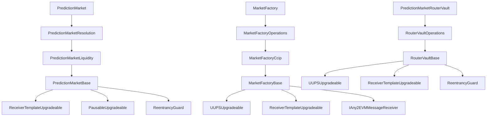

<p align="center">
  <h1 align="center">📜 GeoChain Smart Contracts</h1>
  <p align="center">
    <strong>Modular, upgradeable Solidity contracts for autonomous prediction markets</strong>
  </p>
  <p align="center">
    <a href="#contract-architecture">Architecture</a> ·
    <a href="#contract-reference">Reference</a> ·
    <a href="#deployment">Deployment</a> ·
    <a href="#testing">Testing</a>
  </p>
</p>

> **Solidity 0.8.33 · Foundry · OpenZeppelin UUPS · Chainlink CRE + CCIP**

---

## Contract Architecture

GeoChain's smart contracts are organized into four core systems, each composed as a modular inheritance chain:

```
┌─────────────────────────────────────────────────────────────────────────┐
│                        PREDICTION MARKET                                │
│  PredictionMarket ← Resolution ← Liquidity ← Base ← Receiver(CRE)    │
│  • AMM swaps (YES↔NO)    • Outcome token minting/burning               │
│  • LP accounting          • AI-driven resolution via CRE reports        │
│  • Dispute proposals      • Canonical pricing controls                  │
│  • Post-resolution redeem • Deviation band safety rails                 │
└─────────────────────────────────────────────────────────────────────────┘
         ▲ created by                          ▲ synced by
┌────────┴──────────────────────────┐ ┌───────┴─────────────────────────┐
│        MARKET FACTORY              │ │        ROUTER VAULT              │
│ MarketFactory ← Operations ← Ccip │ │ RouterVault ← Operations ← Base │
│        ← Base ← Receiver(CRE)     │ │         ← Base ← Receiver(CRE)  │
│ • Market creation & registry       │ │ • User credit accounting         │
│ • Collateral management            │ │ • Gasless sponsored operations   │
│ • Hub-spoke CCIP sync             │ │ • Agent delegation & permissions │
│ • Price deviation arbitrage        │ │ • Fiat/ETH onramp credits       │
│ • Pending withdrawal processing   │ │ • All user + agent actions       │
└───────────────────────────────────┘ └─────────────────────────────────┘
         ▲ bridges claims
┌────────┴──────────────────────────┐
│        BRIDGE                      │
│ PredictionMarketBridge             │
│ • Cross-chain claim lock/mint      │
│ • Burn/unlock reverse path         │
│ • Collateral buyback               │
│ • Trusted remote verification      │
└───────────────────────────────────┘
```

### Module Hierarchy



---

## Contract Reference

### Prediction Market

The core AMM-based binary outcome market deployed per event.

#### `PredictionMarketBase.sol`

| Feature | Description |
|---|---|
| **State machine** | `Open → Closed → Review → Resolved` lifecycle |
| **AMM reserves** | `yesReserve`, `noReserve` — constant-product AMM pool |
| **LP accounting** | `lpShares[address]`, `totalShares` for proportional liquidity |
| **Canonical pricing** | `canonicalYesPriceE6`, `canonicalNoPriceE6` — hub-broadcast prices |
| **Deviation bands** | `Normal`, `Stress`, `Unsafe`, `CircuitBreaker` with configurable thresholds |
| **Dispute tracking** | `DisputeSubmission[]`, `uniqueDisputedOutcomes[3]` for dispute window |
| **Risk exposure** | Per-user exposure tracking with exemption flags |

**Deviation Policy Parameters:**

| Parameter | Purpose |
|---|---|
| `softDeviationBps` | Threshold below which no restrictions apply |
| `stressDeviationBps` | Triggers extra fees + max output caps |
| `hardDeviationBps` | Circuit breaker — halts all swaps |
| `stressExtraFeeBps` | Additional fee applied in stress/unsafe bands |
| `stressMaxOutBps` | Max trade size cap in stress band (% of reserve) |
| `unsafeMaxOutBps` | Stricter max trade size cap in unsafe band |

#### `PredictionMarketLiquidity.sol`

| Function | Description |
|---|---|
| `seedLiquidity()` | One-time AMM bootstrap from pre-funded collateral |
| `addLiquidity(yesAmount, noAmount, minShares)` | Balanced LP deposit, proportional share minting |
| `removeLiquidity(shares, minYesOut, minNoOut)` | Burns LP shares, returns proportional YES/NO |
| `removeLiquidityAndRedeemCollateral(shares, minCollateral)` | Removes LP + redeems matched pairs to collateral |
| `withdrawLiquidityCollateral(shares)` | Post-resolution LP settlement path |
| `mintCompleteSets(amount)` | Deposit collateral → mint equal YES + NO tokens (with fee) |
| `redeemCompleteSets(amount)` | Burn equal YES + NO → withdraw collateral (with fee) |
| `swapYesForNo(yesIn, minNoOut)` | AMM swap with canonical pricing controls |
| `swapNoForYes(noIn, minYesOut)` | AMM swap (reverse direction) |
| `transferShares(to, shares)` | LP share transfer between accounts |

#### `PredictionMarketResolution.sol`

| Function | Description |
|---|---|
| `_resolve(outcome, proofUrl)` | Proposes resolution, opens dispute window |
| `disputeProposedResolution(outcome)` | Submits a counter-proposal during dispute window |
| `finalizeResolutionAfterDisputeWindow()` | Finalizes if no dispute was raised |
| `adjudicateDisputedResolution(outcome, proofUrl)` | Owner adjudicates disputed resolution |
| `manualResolveMarket(outcome, proofUrl)` | Manual finalization for `Review` state markets |
| `redeem(amount)` | Burns winning tokens for collateral after resolution |
| `setCanonicalPrice(yesPriceE6, noPriceE6, nonce, validUntil)` | Applies hub-broadcast canonical prices |
| `_processReport(report)` | CRE report dispatcher: `ResolveMarket`, `FinalizeResolution...`, `AdjudicateDisputed...` |

---

### Market Factory

Upgradeable UUPS proxy that creates, registers, and manages prediction markets across chains.

#### `MarketFactoryBase.sol`

| Feature | Description |
|---|---|
| **UUPS proxy** | Upgradeable via `_authorizeUpgrade()` (owner only) |
| **Market registry** | `marketById[id]`, `marketIdByAddress[addr]`, `activeEventList[]` |
| **Hub/spoke identity** | `isHubFactory` flag determines sync behavior |
| **Trusted remotes** | `s_trustedRemote[selector]` for CCIP sender verification |
| **Action hash cache** | Pre-computed `keccak256` hashes for gas-efficient report dispatching |

| Function | Description |
|---|---|
| `initialize(collateral, forwarder, deployer, owner)` | Proxy setup with dependency wiring |
| `createMarket(question, closeTime, resolutionTime)` | Owner entrypoint — deploys market + seeds liquidity |
| `addLiquidityToFactory()` | Mints operational collateral into factory |
| `setMarketDeployer(deployer)` | Updates clone deployer for future markets |

#### `MarketFactoryOperations.sol`

The CRE report dispatcher — processes all workflow-submitted reports.

| Report Action | Payload | Effect |
|---|---|---|
| `createMarket` | `(question, closeTime, resolutionTime)` | Deploys new market + seeds liquidity |
| `broadCastPrice` | `(marketId, yesPriceE6, noPriceE6, validUntil)` | Hub→spoke canonical price CCIP broadcast |
| `syncSpokeCanonicalPrice` | `(marketId, yesPriceE6, noPriceE6, validUntil)` | Direct spoke price update via CRE report |
| `broadCastResolution` | `(marketId, outcome, proofUrl)` | Hub→spoke resolution CCIP broadcast |
| `mintCollateralTo` | `(amount)` | Mints collateral into factory |
| `addLiquidityToFactory` | `()` | Adds factory-held collateral as liquidity |
| `priceCorrection` | `(marketId, maxSpend, minImprovement)` | Automated price deviation arbitrage |
| `processPendingWithdrawals` | `(maxItems)` | Batch-processes post-resolution withdrawal queue |
| `WithCollatralAndFee` | `(marketId)` | Withdraws LP collateral + protocol fees |

**Price Correction Algorithm:**
1. Verifies market is in `Unsafe` deviation band
2. Determines allowed swap direction from canonical pricing controls
3. Binary searches for optimal collateral spend ≤ `maxSpendCollateral`
4. Mints complete sets, executes corrective swap
5. Validates deviation improvement meets `minDeviationImprovementBps`

#### `MarketFactoryCcip.sol`

Hub-spoke cross-chain communication via Chainlink CCIP.

| Function | Description |
|---|---|
| `configureCCIP(router, feeToken, isHub)` | Sets CCIP infrastructure and hub identity |
| `setTrustedRemote(selector, factory)` | Binds spoke selector to trusted factory address |
| `removeTrustedRemote(selector)` | Removes spoke from broadcast list |
| `broadcastCanonicalPrice(marketId, yes, no, validUntil)` | Hub→all spokes price sync via CCIP |
| `broadcastResolution(marketId, outcome, proofUrl)` | Hub→all spokes resolution sync via CCIP |
| `ccipReceive(message)` | Inbound CCIP handler with sender verification + nonce guards |
| `onHubMarketResolved(outcome, proofUrl)` | Callback from market after local finalization |

**CCIP Message Types:**
- `Price` — Updates `setCanonicalPrice()` on spoke markets
- `Resolution` — Triggers `resolveFromHub()` on spoke markets

---

### Router Vault

Custodial vault that manages user balances and enables gasless, agent-delegated operations.

#### `PredictionMarketRouterVaultBase.sol`

| Feature | Description |
|---|---|
| **Credit accounting** | `collateralCredits[user]`, `tokenCredits[user][token]`, `lpShareCredits[user][market]` |
| **Agent permissions** | `agentPermissions[user][agent]` → `AgentPermission { enabled, actionMask, maxAmountPerAction, expiresAt }` |
| **Risk tracking** | `userRiskExposure[user]`, `isRiskExempt[user]` |
| **Action hashes** | Pre-computed `HASHED_AGENT_*` for 8 agent action types |
| **ETH reception** | `receive()` function emits `EthReceived` for log-triggered credit flow |

**Agent Permission Model:**

```solidity
struct AgentPermission {
    bool enabled;
    uint8 actionMask;       // Bitfield: which actions agent can perform
    uint256 maxAmountPerAction; // Max collateral per single operation
    uint256 expiresAt;      // Unix timestamp expiry
}
```

| Action Mask Bit | Action |
|---|---|
| `0x01` | Mint Complete Sets |
| `0x02` | Redeem Complete Sets |
| `0x04` | Redeem Winnings |
| `0x08` | Swap YES→NO |
| `0x10` | Swap NO→YES |
| `0x20` | Add Liquidity |
| `0x40` | Remove Liquidity |
| `0x80` | Dispute Resolution |

#### `PredictionMarketRouterVaultOperations.sol`

All user-facing and agent-delegated actions, plus CRE report processing.

**User Actions (direct):**

| Function | Description |
|---|---|
| `depositCollateral(amount)` | Deposit USDC → credit balance |
| `depositCollateralFor(beneficiary, amount)` | Deposit for another user |
| `withdrawCollateral(amount)` | Withdraw USDC from credits |
| `withdrawOutcomeTokens(market, token, amount)` | Withdraw YES/NO tokens |
| `mintCompleteSets(market, amount)` | Mint YES+NO from collateral credits |
| `redeemCompleteSets(market, amount)` | Burn YES+NO → collateral credits |
| `redeem(market, amount)` | Redeem winning tokens after resolution |
| `swapYesForNo(market, yesIn, minNoOut)` | Swap via AMM |
| `swapNoForYes(market, noIn, minYesOut)` | Swap via AMM (reverse) |
| `addLiquidity(market, yesAmount, noAmount, minShares)` | Provide LP |
| `removeLiquidity(market, shares, minYesOut, minNoOut)` | Remove LP |
| `disputeProposedResolution(market, outcome)` | Submit dispute |
| `setAgentPermission(agent, enabled, actionMask, maxAmount, expiresAt)` | Configure agent |
| `revokeAgentPermission(agent)` | Remove agent access |

**Agent Actions (delegated, `*For` suffix):**

Each agent action calls `_authorizeAgent()` which enforces:
1. Permission is enabled
2. Permission hasn't expired
3. Action bit is set in `actionMask`
4. Amount ≤ `maxAmountPerAction`

| Function | Description |
|---|---|
| `mintCompleteSetsFor(user, market, amount)` | Agent mints on behalf of user |
| `redeemCompleteSetsFor(user, market, amount)` | Agent redeems on behalf of user |
| `swapYesForNoFor(user, market, yesIn, minNoOut)` | Agent swaps on behalf of user |
| `swapNoForYesFor(user, market, noIn, minYesOut)` | Agent swaps on behalf of user |
| `addLiquidityFor(user, market, yes, no, minShares)` | Agent provides LP |
| `removeLiquidityFor(user, market, shares, minYes, minNo)` | Agent removes LP |
| `redeemFor(user, market, amount)` | Agent redeems winnings |
| `disputeProposedResolutionFor(user, market, outcome)` | Agent disputes |

**CRE Report Actions:**

| Action | Purpose |
|---|---|
| `routerDepositFor` | Deposit collateral for a user via CRE |
| `routerMintCompleteSets` | Sponsored mint via CRE |
| `routerRedeemCompleteSets` | Sponsored redeem via CRE |
| `routerRedeem` | Sponsored winning redemption via CRE |
| `routerSwapYesForNo` | Sponsored swap via CRE |
| `routerSwapNoForYes` | Sponsored swap via CRE |
| `routerAddLiquidity` | Sponsored LP provision via CRE |
| `routerRemoveLiquidity` | Sponsored LP removal via CRE |
| `routerDisputeProposedResolution` | Sponsored dispute via CRE |
| `routerCreditFromFiat` | Fiat payment → collateral credit |
| `routerCreditFromEth` | ETH deposit → collateral credit |
| `routerAgent*` | All agent-delegated variants of above |

---

### Bridge

Cross-chain outcome token portability via Chainlink CCIP.

#### `PredictionMarketBridge.sol`

| Function | Description |
|---|---|
| `lockAndBridge(market, token, amount, destSelector)` | Lock tokens → CCIP message → mint wrapped claims on destination |
| `burnAndUnlock(wrappedToken, amount, destSelector)` | Burn wrapped → CCIP message → unlock originals on source |
| `buybackWrappedClaim(wrappedToken, amount)` | Sell wrapped claims for collateral at configured ratio |
| `ccipReceive(message)` | Inbound handler (mint or unlock based on message type) |

**Security:**
- Trusted remote verification per chain selector
- Replay protection via `processedMessages[messageId]`
- Winning-side validation for buyback operations

#### `BridgeWrappedClaimToken.sol`

ERC-20 wrapped claim token, mintable/burnable only by the bridge contract.

---

### Libraries

#### `AMMLib.sol`
Constant-product AMM math: `calculateShares()`, `getAmountOut()`, `calculateSwapOutput()`.

#### `FeeLib.sol`
Standardized fee calculations: `applyMintFee()`, `applyRedeemFee()`, `applySwapFee()`.

#### `MarketTypes.sol`
Shared enums (`State`, `Resolution`), errors, events, and constants (`SWAP_FEE_BPS`, `MINT_COMPLETE_SETS_FEE_BPS`, `REDEEM_FEE_BPS`, `PRICE_PRECISION`, etc.).

---

### Modules

#### `CanonicalPricingModule.sol`
Pure library for deviation band calculations. Given canonical and local AMM prices, computes:
- Which band (`Normal`, `Stress`, `Unsafe`, `CircuitBreaker`) the market is in
- Effective swap fee (base + stress uplift)
- Maximum allowed trade output
- Permitted swap directions

---

### Token

#### `OutcomeToken.sol`
ERC-20 token for YES/NO outcomes. Mint and burn restricted to the owning prediction market contract.

---

## Directory Structure

```
contract/
├── src/
│   ├── predictionMarket/
│   │   ├── PredictionMarket.sol              # Concrete entry point (229 lines)
│   │   ├── PredictionMarketBase.sol          # State, modifiers, canonical pricing (528 lines)
│   │   ├── PredictionMarketLiquidity.sol     # AMM, LP, complete sets, swaps (325 lines)
│   │   └── PredictionMarketResolution.sol    # Resolution, disputes, CRE reports (351 lines)
│   ├── marketFactory/
│   │   ├── MarketFactory.sol                 # UUPS proxy entry (20 lines)
│   │   ├── MarketFactoryBase.sol             # Registry, collateral, config (389 lines)
│   │   ├── MarketFactoryCcip.sol             # CCIP hub-spoke sync (385 lines)
│   │   ├── MarketFactoryOperations.sol       # CRE report dispatcher (367 lines)
│   │   └── MarketDeployer.sol                # Market clone factory
│   ├── router/
│   │   ├── PredictionMarketRouterVault.sol   # Proxy entry (23 lines)
│   │   ├── PredictionMarketRouterVaultBase.sol    # Credits, permissions (215 lines)
│   │   └── PredictionMarketRouterVaultOperations.sol  # All actions (676 lines)
│   ├── Bridge/
│   │   ├── PredictionMarketBridge.sol        # CCIP cross-chain claims (28KB)
│   │   └── BridgeWrappedClaimToken.sol       # Wrapped ERC-20 claim token
│   ├── libraries/
│   │   ├── AMMLib.sol                        # Constant-product AMM math
│   │   ├── FeeLib.sol                        # Fee calculation utilities
│   │   └── MarketTypes.sol                   # Shared types, errors, constants
│   ├── modules/
│   │   └── CanonicalPricingModule.sol        # Deviation band logic
│   └── token/
│       └── OutcomeToken.sol                  # ERC-20 YES/NO tokens
├── script/
│   ├── deployMarketFactory.s.sol             # Factory UUPS proxy deployment
│   ├── deployRouterVault.s.sol               # Router UUPS proxy deployment
│   ├── deployBridge.sol                      # Bridge deployment
│   ├── upgradeMarketFactory.s.sol            # UUPS upgrade script
│   └── interaction/                          # On-chain interaction scripts
├── test/
│   ├── unit/                                 # Unit tests (4 test files)
│   ├── statelessFuzz/                        # Stateless fuzz tests
│   └── statefullFuzz/                        # Stateful invariant tests
└── foundry.toml                              # Foundry config
```

---

## Deployment

### Prerequisites

- [Foundry](https://book.getfoundry.sh/getting-started/installation) (Forge, Anvil, Cast)

### Build

```bash
cd contract
forge install    # Install OpenZeppelin + forge-std
forge build      # Compile with via_ir + optimizer (200 runs)
```

### Local Deployment (Anvil)

```bash
# Terminal 1: Start local chain
anvil

# Terminal 2: Deploy contracts
forge script script/deployMarketFactory.s.sol --rpc-url http://127.0.0.1:8545 --broadcast
forge script script/deployRouterVault.s.sol --rpc-url http://127.0.0.1:8545 --broadcast
forge script script/deployBridge.sol --rpc-url http://127.0.0.1:8545 --broadcast
```

> Default Anvil accounts are used: Account #0 as owner, Account #1 as forwarder placeholder.

### Testnet Deployment

```bash
forge script script/deployMarketFactory.s.sol \
  --rpc-url https://sepolia-rollup.arbitrum.io/rpc \
  --private-key $PRIVATE_KEY \
  --broadcast --verify
```

### UUPS Upgrade

```bash
forge script script/upgradeMarketFactory.s.sol \
  --rpc-url $RPC_URL \
  --private-key $PRIVATE_KEY \
  --broadcast
```

---

## Testing

### Test Suite

```bash
# Run all tests
forge test

# Verbose output
forge test -vv

# Gas profiling
forge test --gas-report

# Coverage report
forge coverage
```

### Test Categories

| Directory | Type | Description |
|---|---|---|
| `test/unit/` | Unit tests | Individual function behavior verification |
| `test/statelessFuzz/` | Stateless fuzz | Random input testing for edge cases |
| `test/statefullFuzz/` | Stateful invariant | Multi-step invariant checking (1000 runs, depth 50) |

### Foundry Configuration

```toml
[profile.default]
src = "src"
optimizer = true
optimizer_runs = 200
via_ir = true

[invariant]
run = 1000
debt = 50
fail_on_revert = true
```

---

## Deployed Addresses

### Arbitrum Sepolia (Hub)

| Contract | Address |
|---|---|
| MarketFactory | `0x1dAf6Ecab082971aCF99E50B517cf297B51B6e5C` |
| RouterVault | `0x0d9498795752AeDF56FF3C2579Dd0E91994CadCe` |
| Bridge | `0xcb55019591457b2Ea6fbCd779cAF087a6890a06A` |
| Collateral (USDC) | `0x52539038C1d1C88AA12438e3c13ADC6778B966Fc` |

### Base Sepolia (Spoke)

| Contract | Address |
|---|---|
| MarketFactory | `0x73f6A1a5B211E39AcE6F6AF108d7c6e0F77e3B92` |
| RouterVault | `0x2bE604A2052a6C5e246094151d8962B2E98D8f7c` |
| Bridge | `0x915E3Ee1A09b08038e216B0eCbe736164a246aA3` |
| Collateral (USDC) | `0xB17Ede44C636887ce980D9359A176a088DC46c2f` |

---

## Related Documentation

- [Market Workflow README](../cre/market-workflow/README.md) — CRE automation workflow
- [Agents Workflow README](../cre/agents-workflow/README.md) — Agent trading CRE workflow
- [Project README](../README.md) — Full project documentation
